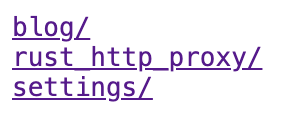

## static file serve AND Http TUNNEL proxy

### Usage

```shell
curl -SLfO https://github.com/arloor/go_web_server/releases/download/v1.0.0/go_web_server # v1.0.0 is auto updated by github action 
install go_web_server /usr/local/bin/go_web_server
go_web_server
```

```shell
2023/12/24 15:46:27 config.go:38: go web server config: 
addr: :7788
tls: false
cert: cert.pem
key: privkey.pem
log: /tmp/proxy.log
content: /data
auth: ""
2023/12/24 15:46:35 httpHandlerFunc.go:47: xxxxxxxxx:55054     GET / HTTP/1.1
2023/12/24 15:46:35 httpHandlerFunc.go:47: xxxxxxxxx:55054     GET /favicon.ico HTTP/1.1
2023/12/24 15:46:36 httpHandlerFunc.go:47: xxxxxxxxx:55054     GET /rust_http_proxy/ HTTP/1.1
.....
2023/12/24 15:47:38 httpHandlerFunc.go:45: xxxxxxxxx:56902 CONNECT baidu.com:443 HTTP/1.1
2023/12/24 15:47:46 httpHandlerFunc.go:45: xxxxxxxxx:38208 CONNECT www.baidu.com:443 HTTP/1.1
```

### static files dowload



### Http TUNNEL proxy

```shell
curl https://www.baidu.com -p -x https:/localhost:7788 -v --proxy-insecure -U username:password
```
